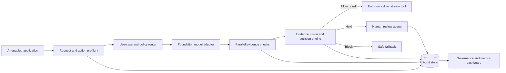

# ControlPlane.ai — Final Proposal Plan (Round 2)

> **Base document:** this plan adopts the architecture, governance model, decision logic,
> metrics framework, and non-goals from the team proposal plan, unchanged, because it is
> the more defensible design. **What's added below:** a brief-to-plan traceability matrix,
> a stated regulatory jurisdiction, an 8th demo scenario for adversarial robustness, a
> reason-code taxonomy, a cost-of-checking accounting, a short competitive-landscape note,
> a concrete synthetic dataset spec, and a day-by-day build schedule. Additions are marked
> **[NEW]** inline so the team can see exactly what changed and approve or cut it.

---

## 1. Proposal thesis

**ControlPlane.ai is an evidence-aware runtime control layer for enterprise AI.** It sits between an AI-enabled application and a foundation-model API, evaluates the request, response, and intended downstream action, and applies a configurable decision: **allow, warn/edit, hold for human review, or block**.

The central argument is not that hallucination, privacy leakage, or bias can be eliminated. The proposal shows how an enterprise can **measure, govern, and deliberately trade off these risks for each use case** while retaining an audit trail. The product works at the input/output boundary and therefore does not require model weights, fine-tuning, or access to model internals.

### One-sentence pitch

> ControlPlane.ai gives every enterprise AI use case its own evidence requirements, risk budget, and response policy — then proves how each runtime decision was made.

**[NEW] Framing line for the video/deck cold open** (keep the technical pitch above as the written thesis; use this as the spoken hook, since it's more memorable under time pressure):

> Trust isn't a property of a response. It's a property of a decision. ControlPlane governs the moment output becomes binding.

### Differentiation

1. **Use-case-specific control:** a public support bot, internal copilot, and refund agent do not share one threshold or pipeline.
2. **Evidence fusion, not a single judge:** deterministic rules, source verification, numeric recomputation, PII detection, and model disagreement contribute separate evidence signals.
3. **Honest abstention:** "insufficient evidence" is a supported outcome. Consistent generations increase stability confidence but do not prove factual truth.
4. **Cascade-aware agent governance:** the system considers the intended action and accumulated session risk, not only the latest sentence.
5. **Policy-as-data:** thresholds, checks, geography/industry overlays, escalation rules, and policy versions are configurable and auditable rather than hard-coded.

---

## 2. Problem framing

Enterprises are deploying generative AI across use cases with materially different consequences. A false FAQ answer may be recoverable; an invented refund policy or autonomous financial action may create direct loss, privacy exposure, and regulatory liability. Existing approaches commonly fail because they:

- apply a uniform safety pipeline regardless of use case or latency budget;
- treat hallucination, privacy, and bias as independent labels even when one output spans several risks;
- assume an authoritative source is always available;
- report only detection accuracy while hiding false-negative cost, human-review load, and alert fatigue;
- assess each response in isolation even when agents create multi-step cascades; and
- encode policy in application logic that becomes stale as organizational or regulatory expectations change.

### Proposed problem statement

> How might an enterprise govern heterogeneous AI applications at runtime, using only API-level inputs and outputs, while balancing latency, user experience, human-review capacity, and the asymmetric cost of missed risks?

---

## 3. Round 2 brief traceability matrix **[NEW]**

Every judge-facing complexity and solutioning area from the official Round 2 brief, mapped to where this plan addresses it. Use this table directly in the proposal's appendix or as a checklist before submission — it is the fastest way for a judge to confirm nothing was skipped.

| Brief item | Addressed in |
|---|---|
| Different use cases need different risk tolerance/latency budgets | §5 policy profiles; §6 use-case router; §7 policy fields |
| Bias/hallucination/privacy risks overlap in one output | §5 evidence bundles with multiple labels; §6 "why checks are framed as evidence" |
| No reliable real-time ground truth to check against | §6 disagreement scoring; §9 evidence-availability labels (supported/contradicted/unsupported/unavailable) |
| Over-flagging causes alert fatigue; under-flagging causes liability | §9 cost-weighted loss; §10 trustworthiness scorecard; explicitly *tuned*, not solved |
| Multi-turn/agentic actions compound risk | §5 session-level cascade risk; Demo scenario 7 (and 8, new) |
| Regulatory expectations vary by geography/industry and evolve | §7 policy overlays; §7a jurisdiction assumption **[NEW]** |
| Enterprises consume models via API, no internals access | §1 thesis, stated explicitly; architecture works at I/O boundary only |
| Detection techniques (rules, embeddings, AI-as-judge, retrieval, PII) | §6 runtime sequence checks |
| Decision logic (confidence scoring, tiers, human-in-loop rules) | §8 decision logic; §8a reason codes **[NEW]** |
| Architecture (where checker sits, parallel checks) | §6 diagram and sequence |
| Governance (configurable policy layer, audit trail) | §7 policy design |
| Feedback loops | §9 feedback loop subsection |
| Metrics & monitoring, reported to a skeptical stakeholder | §9 full metrics section |

---

## 4. Users and stakeholders

| Stakeholder | Need | Prototype evidence |
|---|---|---|
| Application/product owner | Ship AI features without one-size-fits-all friction | Use-case profiles and latency budgets |
| Risk/compliance owner | Define policy and explain decisions | Versioned policy view and audit records |
| Human reviewer | Understand why a case was held and act quickly | Evidence bundle and override workflow |
| AI/platform engineer | Integrate one control layer across models/apps | Stable middleware API and provider abstraction |
| Executive/auditor | See whether risk is improving without metric theatre | Confusion matrix, coverage, latency, overrides, and cost measures |
| End user | Receive useful output without hidden unsafe behavior | Allow, edited warning, review, and block experiences |

---

## 5. Solution scope

### In scope for the working prototype

- Three policy profiles: `support_bot`, `internal_copilot`, and `refund_agent`.
- Request/action blast-radius classification using explicit action metadata plus deterministic indicators.
- PII detection and redaction for a bounded set of identifiers.
- Claim extraction and attribution against simulated policy documents.
- Deterministic recomputation of refund values from simulated order data.
- Multi-generation disagreement scoring when no authoritative evidence is available.
- Overlapping risk signals attached to the same claim or output.
- Session-level accumulated risk for a small multi-step agent scenario.
- Tiered decisions: `allow`, `warn_or_edit`, `hold_for_human`, and `block`.
- Versioned policy configuration with use-case and geography/industry overlays.
- SQLite audit trail, human labels/overrides, and a metrics dashboard.
- Simulated LLM responses by default, with a replaceable model-provider interface for a live API demo.
- **[NEW]** A basic prompt-injection heuristic on the input side, demonstrated with one adversarial scenario (see §9).

### Explicit non-goals

- Claiming universal hallucination, bias, or PII detection.
- Interpreting consistency across model samples as proof of truth.
- Building a production-grade legal compliance engine.
- Training or fine-tuning a foundation model.
- Supporting every document type, language, geography, or enterprise action.
- Automatically learning new thresholds from a very small demo dataset.
- **[NEW]** Claiming robustness against sophisticated, actively adapting adversarial input — the prototype demonstrates the *mechanism*, not a hardened defense.

These boundaries make the prototype credible: it demonstrates the control mechanism and measurement discipline without overstating what a limited dataset can establish.

---

## 6. Core system design



### Runtime sequence

1. The calling application supplies the use case, user request, intended action, region, session ID, and available business context.
2. The router resolves a versioned policy profile and permitted latency budget.
3. Preflight checks identify sensitive input, screen for injection patterns **[NEW]**, and estimate blast radius before any action is permitted.
4. The model adapter obtains a response. The default demo uses deterministic fixtures; a live provider remains optional.
5. Applicable checks run concurrently where possible:
   - PII/entity detection;
   - policy-claim attribution;
   - refund recomputation;
   - response-sample disagreement when grounding is unavailable; and
   - session/cascade-risk assessment.
6. Each checker returns a structured signal containing severity, confidence, evidence, limitations, and applicable risk labels. Signals may carry multiple labels.
7. The decision engine combines evidence according to the active policy, blast radius, and session history.
8. The complete decision bundle is logged. Held cases can be confirmed, dismissed, or overridden by a human.

### Why these checks are framed as evidence

- **Document similarity is retrieval evidence, not entailment.** A matched paragraph can support review, but a close embedding alone cannot prove that the response follows the policy.
- **Semantic disagreement measures instability, not factuality.** Several consistent wrong answers remain possible. The signal is used mainly when no ground truth exists and is weighted more strongly for high-impact actions.
- **Rules are bounded controls, not universal classifiers.** The demo shows their scope and leaves a clear extension point for learned or AI-as-judge detectors.

### 6a. Cost-aware check routing **[NEW]**

Checking is not free — the disagreement check alone costs 3–5 extra model calls per flagged request. Left unmanaged, verification cost scales with traffic the same way the original request cost does, which undermines the "we don't slow everything down" claim on the compute-cost axis, not just the latency axis. The prototype should route the *checks themselves* by the same blast-radius signal that routes the primary request:

| Blast radius | Grounding check | Disagreement sampling | Numeric recompute |
|---|---|---|---|
| R0 (read-only) | claim-triggered retrieval | 2 samples only when evidence is unavailable | skip |
| R1 (draft) | claim-triggered retrieval | 2 samples only when evidence is unavailable | skip |
| R2 (reversible write) | similarity + basic entailment | 2 samples only when evidence is unavailable | if applicable |
| R3 (irreversible) | full attribution | up to 5 samples only when evidence is unavailable | always when applicable, blocking on mismatch |

This turns "verification cost" into a measured, reported number (see §10) rather than an unbounded add-on — directly extending the brief's cost-tolerance point to the checker's own resource use, not only the primary model call.

---

## 7. Policy and governance design

Governance is a first-class product surface, not a paragraph added after the detector design.

### Policy profile fields

Each versioned profile defines:

- use case and owner;
- allowed model/provider;
- risk appetite and permitted action types;
- required and optional checks;
- thresholds and signal weights;
- maximum latency and timeout behavior;
- decision matrix and safe fallback;
- human-review triggers and reviewer role;
- data-retention/redaction rules;
- geography and industry overlays;
- effective date, version, approver, and change reason.

### 7a. Stated regulatory jurisdiction **[NEW]**

The brief notes regulatory expectations vary by geography and evolve — a rigid, hard-coded rule set ages quickly. Rather than leaving this abstract, the prototype states one primary jurisdiction and demonstrates the overlay mechanism with a second:

- **Primary assumption:** India's Digital Personal Data Protection Act (DPDP), 2023 governs the default `retention_rules` and `pii_categories` in all three profiles.
- **Overlay demonstration:** a second, EU-flavored policy overlay (GDPR-aligned retention and consent fields) is applied to the same `refund_agent` profile to show the same use case behaving differently by region — this is what makes "geography overlay" a demonstrated mechanism rather than a claimed one.
- Regulatory citations should be verified against current guidance before the final written proposal is submitted, since both frameworks are subject to amendment and the team's own knowledge may be dated by submission time.

### Example policy behavior

| Profile | Typical latency target | Evidence requirement | Default under uncertainty | High-impact action behavior |
|---|---:|---|---|---|
| Support bot | Low | PII plus policy grounding when a policy is cited | Warn/edit | Cannot execute financial actions |
| Internal copilot | Moderate | PII plus source attribution where available | Warn with provenance gap | Hold actions leaving the enterprise |
| Refund agent | Higher | Order recomputation, policy grounding, PII, and session risk | Hold | Block mismatch; require approval above configured limit |

The numerical latency targets and approval limits are presented as **demo assumptions**, not universal benchmarks.

### Change-control workflow

1. A policy owner proposes a new version with a reason and expected impact.
2. The version is evaluated against a labeled regression set before activation.
3. The dashboard compares old and new false-positive, false-negative, latency, and review-load estimates.
4. An authorized approver activates or rejects it.
5. Every runtime record stores the exact policy version used, enabling replay and audit.

The prototype need only demonstrate policy resolution, version display, and replayable audit metadata. Full enterprise identity and approval infrastructure belongs in later phases.

---

## 8. Decision logic

The decision engine avoids a naive "count the flags" design. It uses:

- **hard constraints:** for example, a recomputed financial mismatch blocks an automated refund;
- **risk-weighted evidence:** the same uncertainty can be tolerated for a draft FAQ but deferred for a financial action;
- **evidence availability:** missing grounding is different from evidence contradicting a claim;
- **session accumulation:** repeated warnings or a risky chain can escalate a later step; and
- **policy-specific thresholds:** thresholds reflect business risk and review capacity.

Every outcome includes a machine-readable reason code and a plain-language explanation. The system does not collapse all risks into one unexplained score.

### 8a. Reason code taxonomy **[NEW]**

A fixed, small vocabulary keeps every decision auditable and demoable without inventing labels ad hoc mid-build:

| Code | Meaning | Typical trigger |
|---|---|---|
| `PII_DETECTED_OUTPUT` | Sensitive identifier found in response | regex/Presidio match |
| `PII_DETECTED_INPUT` | Sensitive identifier found in request | regex/Presidio match on input |
| `CLAIM_UNSUPPORTED` | Claim not attributable to any source document | similarity below threshold |
| `CLAIM_CONTRADICTED` | Claim conflicts with a retrieved source | contradiction check |
| `NUMERIC_MISMATCH` | Stated figure disagrees with system of record | deterministic recompute |
| `HIGH_DISAGREEMENT` | Repeated samples diverge in meaning | semantic entropy above threshold |
| `EVIDENCE_UNAVAILABLE` | No source corpus exists for this claim type | retrieval returns nothing |
| `CASCADE_RISK_ELEVATED` | Session risk score crossed threshold from prior steps | accumulated risk |
| `ACTION_BLAST_RADIUS_HIGH` | Requested action is irreversible or regulated | blast-radius classifier |
| `POLICY_VERSION_STALE` | Request evaluated against an outdated policy version | version check at load |
| `INJECTION_SUSPECTED` | Input resembles a prompt-injection/jailbreak pattern | input heuristic |
| `HUMAN_OVERRIDE` | Reviewer changed the system decision | audit log entry |

Each logged decision carries one or more of these codes, which is also what makes the metrics dashboard in §10 countable rather than descriptive.

---

## 9. Demo scenarios

The demo tells one coherent story through eight seeded scenarios (seven from the base plan, one added for adversarial robustness):

| # | Scenario | Expected outcome | Capability demonstrated |
|---:|---|---|---|
| 1 | Support bot answers a grounded delivery question | Allow | Low-friction path and attribution |
| 2 | Support response exposes an email and card-like number | Edit/warn | PII redaction and overlapping risk labels |
| 3 | Bot invents a refund-policy clause | Hold | Unsupported policy claim and evidence bundle |
| 4 | Refund agent proposes an amount different from order data | Block | Blast radius plus deterministic recomputation |
| 5 | No source exists and repeated generations materially disagree | Hold for high-risk profile | Ground-truth fallback with honest uncertainty |
| 6 | The same uncertain answer is requested by the low-risk support profile | Warn | Different policies for identical evidence |
| 7 | A multi-step agent moves from lookup to email to refund | Escalate before action | Accumulated cascade risk |
| 8 **[NEW]** | A user tries to override the refund agent's instructions while requesting a privileged refund action | Block at input stage, before the model call | Policy-aware input screening, `INJECTION_SUSPECTED` reason code, and the limits of that screening stated explicitly |

For each scenario, the UI shows the selected policy, checks run, evidence, latency, decision, and audit ID. A reviewer labels at least one held result, after which the metrics view updates live.

---

## 10. Metrics and evaluation plan

### Offline safety evaluation

A small labeled scenario set includes clean, privacy-risk, unsupported-claim, numeric-mismatch, and overlapping-risk examples. Results are segmented by use case and risk type rather than reported as one aggregate accuracy number.

Report:

- true positives, false positives, true negatives, and false negatives;
- precision and recall;
- false-positive rate and false-negative rate;
- intervention rate by outcome;
- evidence coverage: fraction of claims for which authoritative evidence was available;
- deferral/review rate and estimated reviewer workload; and
- results at the selected threshold plus at least one stricter/looser alternative.

Because missed high-impact risks are more costly than nuisance warnings, the proposal includes a **cost-weighted loss**:

`expected risk cost = Σ(outcome count × business-assigned outcome cost)`

This makes alert-fatigue tuning explicit. It does not pretend that one threshold is objectively correct.

### Runtime and operational metrics

- median and p95 end-to-end latency;
- per-check latency and timeout rate;
- allow/edit/hold/block distribution;
- human time-to-review;
- reviewer agreement and override rate;
- policy version adoption and drift in intervention rate;
- audit completeness;
- model/provider error and fallback rate; and
- **[NEW] verification compute cost:** model calls spent on checking, per blast-radius tier, per §6a — reported alongside primary-call cost so "checker overhead" is a cost number, not only a latency number.

### Trustworthiness scorecard

The dashboard does not expose one opaque "trust score." It presents four dimensions separately:

1. **Safety effectiveness:** recall, false-negative rate, and cost-weighted loss.
2. **Operational burden:** false-positive rate, deferrals, and reviewer workload.
3. **Evidence quality:** grounding coverage, contradiction/unsupported rates, and unavailable-evidence rate.
4. **Reliability:** latency, timeouts, audit completeness, and fallback behavior.

### Feedback loop

Human review creates labels, not automatic truth. The feedback loop:

1. records confirmation, dismissal, or override with a reason;
2. updates dashboard metrics;
3. surfaces recurring false-positive/negative categories; and
4. proposes threshold or rule changes for offline evaluation.

No threshold silently changes in production. A policy owner must review a regression comparison and approve a new version.

---

## 11. Business case

### Value levers

- reduce preventable loss from incorrect automated actions;
- reduce privacy and compliance incident exposure;
- shorten approval cycles for new AI use cases by reusing a common control plane;
- reduce manual review through risk-based routing instead of reviewing every interaction; and
- produce defensible evidence for internal audit and enterprise customers.

### Quantification model

Transparent, editable assumptions rather than unsupported savings claims:

- weekly AI interactions by use case;
- baseline harmful-output rate from a labeled sample;
- average cost by incident class;
- detection recall at the chosen policy threshold;
- reviewer volume, minutes per review, and labor cost;
- engineering/compliance hours saved per new AI use case; and
- infrastructure/model cost of additional checks and samples, **including the verification-compute line from §10 [NEW]**, since a control layer that quietly doubles inference spend on high-risk traffic is a real cost, not a rounding error, and should be shown as one.

Then calculate:

`annual net benefit = avoided incident cost + governance efficiency − review cost − compute/platform cost`

The final proposal includes conservative, expected, and aggressive scenarios, with every assumption labeled. The prototype exposes the measurements needed for this model but does not claim statistically reliable ROI from its small simulated dataset.

### Adoption model

The likely enterprise path is a platform capability deployed as API middleware, initially for a high-value workflow. Commercialization can be framed as usage-based platform pricing plus governance/analytics tiers, while keeping the Round 2 focus on enterprise value rather than speculative revenue.

### 11a. Competitive landscape, briefly **[NEW]**

Two categories of existing tooling already partially cover this space, and the proposal should name them rather than let a judge raise it first:

- **Observability platforms** (e.g. tracing/logging layers for LLM calls) — they record what happened, well, but do not decide or intervene in real time.
- **Guardrail frameworks** (e.g. rule-based or classifier-based input/output filters) — they filter text patterns but generally apply one pipeline uniformly and do not reason about the downstream action's blast radius or accumulate session risk.

ControlPlane's claimed gap is specific: **per-use-case policy + action-consequence awareness + session-level accumulation, unified under one auditable decision engine** — not a new detection technique, and not a claim that no piece of this has been attempted before.

---

## 12. Phased roadmap

### Phase 0 — Design and evaluation contract

- agree on use cases, actions, risk taxonomy, decision costs, and human-review capacity;
- construct the labeled regression set; and
- define policy ownership and audit requirements.

### Phase 1 — Round 2 prototype

- three use-case profiles and eight demo scenarios;
- bounded PII, grounding, disagreement, numeric, injection, and cascade checks;
- tiered decision engine;
- audit log, reviewer feedback, and metrics dashboard; and
- deterministic demo mode with optional live model adapter.

### Phase 2 — Controlled pilot

- integrate one real, non-critical enterprise use case in shadow mode;
- connect governed sources and enterprise identity;
- measure baseline, tune thresholds, and capacity-plan review queues;
- add policy regression tests, monitoring, and access controls; and
- complete privacy/security assessment.

### Phase 3 — High-impact workflows

- add action-level authorization and approval boundaries;
- expand claim verification beyond similarity toward entailment/citation validation;
- add stronger PII/entity tooling and adversarial testing;
- introduce session and agent trace analysis; and
- support policy promotion/rollback with formal approvals.

### Phase 4 — Enterprise scale

- multi-region deployment and jurisdiction/industry policy packs;
- model/provider benchmarking and routing;
- continuous drift monitoring and red-team regression suites;
- SIEM/GRC integrations, immutable audit export, and SLOs; and
- federated governance across business units.

---

## 13. Risks and mitigations

| Risk | Why it matters | Mitigation / honest boundary |
|---|---|---|
| Consistent but false generations | Low disagreement can create false confidence | Never treat agreement as factual proof; increase review for high-impact ungrounded actions |
| Retrieval similarity without entailment | Related text may not support the exact claim | Show source evidence; distinguish supported, contradicted, unsupported, and unavailable |
| Keyword/rule evasion | Simple classifiers miss paraphrases and new patterns | Require explicit action metadata; add learned classifiers later; maintain adversarial regression tests |
| **Prompt injection / jailbreak attempts [NEW]** | An adversarial input could try to alter agent behavior or bypass checks | Deterministic input screening (scenario 8); explicitly stated as partial coverage, not a hardened defense |
| Alert fatigue | Users bypass a noisy system | Tune by cost and review capacity; segment metrics; offer edit/warn instead of binary blocking |
| False negatives | Missed risks can create material harm | Hard constraints for deterministic checks; conservative high-impact defaults; post-hoc sampling and red-team tests |
| Detector/model correlation | An AI judge may repeat the generator's mistake | Fuse heterogeneous evidence and prioritize deterministic business data when available |
| Sensitive audit logs | Safety telemetry can become a new privacy store | Redact/minimize, role-limit, encrypt, and configure retention; prototype uses synthetic data only |
| Policy drift | Rules become stale or inconsistent | Versioning, ownership, effective dates, regression testing, approval, and rollback |
| Added latency/cost | Extra checks can damage the product experience | Route checks by use case and blast radius (§6a), parallelize, cache governed sources, set timeouts, and measure p95 latency and verification compute cost |
| Human review bottleneck | Deferral can halt operations | Capacity-aware thresholds, prioritized queues, clear evidence bundles, and fail-safe workflows |
| Demo overfitting | Seeded cases can exaggerate effectiveness | Separate demo stories from a broader hidden regression set and label sample-size limitations |

---

## 14. Prototype implementation plan (held until approval)

### Proposed stack

- **Backend:** Python and FastAPI.
- **Decision/audit data:** SQLite for the prototype, behind a repository abstraction.
- **Configuration:** versioned JSON policy profiles validated at startup.
- **Frontend:** a lightweight web dashboard optimized for a clear live demo (the existing HTML mockup can be re-wired to real endpoints rather than rebuilt).
- **Test data:** synthetic policy documents, orders, sessions, and labeled scenarios (see Appendix A).
- **Model integration:** provider interface with deterministic fixtures by default and an optional environment-configured live provider.
- **[NEW] Embeddings:** `sentence-transformers` (e.g. all-MiniLM) for grounding similarity and disagreement clustering — cheap, local, no extra API cost.
- **[NEW] PII detection:** Microsoft Presidio, or regex fallback for a bounded identifier set if Presidio setup time is a constraint.

### Intended repository shape

```text
controlplane-ai/
├── app/                 # API, pipeline, checks, policy, audit, metrics
├── config/              # Versioned use-case and overlay policies
├── data/                # Synthetic policies, orders, sessions, demo scenarios, and separate evaluation cases
├── frontend/            # Demo dashboard
├── tests/               # Unit, policy-regression, and end-to-end tests
├── docs/                # Business proposal, architecture, and demo script
├── README.md
└── requirements/lock files
```

### Definition of done for the prototype

- All eight seeded scenarios execute through the real middleware pipeline.
- At least three profiles demonstrably produce different decisions for shared evidence.
- Each decision names its policy version, signals, evidence availability, and reason codes.
- High-impact numeric mismatch cannot pass due to a weighted-score accident.
- Human feedback changes the displayed evaluation metrics but not live policy automatically.
- The dashboard reports both false positives and false negatives from labeled cases, and verification compute cost per tier.
- An end-to-end test validates request → checks → decision → audit → review → metrics.
- The repository runs from documented commands without requiring proprietary data.
- A short demo completes reliably in under five minutes.

---

## 15. Submission package plan

### Detailed business proposal — recommended narrative order

1. Executive summary and quantified problem.
2. Why existing one-size-fits-all guardrails fail (include §11a competitive note).
3. User/stakeholder needs.
4. ControlPlane.ai value proposition.
5. Architecture and runtime decision flow.
6. Technical novelty and evidence strategy.
7. Governance and configurable policies, including stated jurisdiction (§7a).
8. Metrics, alert-fatigue tradeoff, and evaluation results.
9. Business case and adoption approach.
10. Phased roadmap.
11. Risks, limitations, and mitigations.
12. Prototype results and next ask.
13. **[NEW]** Appendix: brief traceability matrix (§3).

### Public repository

- concise setup and demo commands;
- architecture diagram and policy examples;
- synthetic-data notice and security limitations;
- automated test instructions and sample output;
- screenshots/GIF where useful; and
- license and contribution notes before publication.

### Demo video (target: 4–5 minutes)

1. **0:00–0:30:** enterprise problem and thesis.
2. **0:30–1:00:** three use-case policies and different risk appetites.
3. **1:00–2:45:** grounded allow, invented-policy hold, and refund-mismatch block.
4. **2:45–3:30:** no-ground-truth disagreement, cascade-risk scenario, and injection-block scenario.
5. **3:30–4:15:** audit explanation, human override, and metrics update.
6. **4:15–4:45:** limitations, business value, and roadmap.

---

## 16. Decisions required before implementation

1. Build a **credible narrow control plane**, not twelve shallow detectors.
2. Make the **refund agent** the high-impact hero workflow.
3. Use **synthetic deterministic responses** for the judged demo, with live API access optional.
4. Treat **governance and metrics as product features**, not documentation-only sections.
5. Show **false positives, false negatives, and review burden** explicitly.
6. Avoid claiming that embeddings or semantic entropy determine truth.
7. Keep automated policy learning out of the MVP; use approval-gated feedback instead.
8. **[NEW]** Adopt India's DPDP Act as the primary jurisdiction assumption, with a GDPR-flavored overlay as the geography-configurability demo.
9. **[NEW]** Include scenario 8 (prompt-injection block) as in-scope, and state its coverage limits explicitly rather than implying general adversarial robustness.

Implementation should begin only after this scope and narrative are approved.

---

## Appendix A — Synthetic dataset spec **[NEW]**

Concrete enough to hand to whoever builds the data layer without further discussion:

**`data/orders.csv`**
`order_id, customer_id, item, order_total_inr, order_date, status`
~15 rows, including at least one order with a status that makes a refund request questionable (already refunded, cancelled, out of return window).

**`data/policy_docs/refund_policy_v1.md`**
~6 short clauses, enough to make attribution meaningful:
1. Damaged items — eligible for replacement or store credit, not automatic full refund.
2. Wrong item shipped — eligible for full refund.
3. Change of mind — store credit only, within a 7-day window.
4. Digital goods — non-refundable once delivered.
5. Late delivery beyond SLA — partial credit.
6. Suspected fraud/chargeback pattern — hold for manual review, no automated action.

**`data/sessions.json`**
One scripted multi-step session: `lookup_order` → `draft_email` → `issue_refund`, used for scenario 7 (cascade risk).

**`data/demo_scenarios.json`**
Eight entries, one per judge-facing scenario in §9, each with: input prompt, use-case profile, expected reason code(s), and expected decision.

**`data/evaluation_scenarios.json`**
A separate labeled set containing clean and risky variations not used to script the eight demo stories. This is the regression/evaluation set referenced in §10, avoiding measurement against only the cases the demonstration was built to pass.

---

## Appendix B — Reason code enum (source of truth)

See §8a. Keep this list exactly as declared in one shared constants file (`app/reason_codes.py` or equivalent) that every checker imports — do not let checkers invent string literals ad hoc, or the audit log becomes unqueryable.

---

## Appendix C — Round 2 execution schedule **[NEW]**

Illustrative day-by-day plan; adjust to the actual submission deadline and team size. Assumes a ~10–14 day build window and a team of 3–4.

| Day | Focus | Owner (suggested role) |
|---|---|---|
| 1–2 | Lock scope against §16; author synthetic dataset (Appendix A); draft policy JSON schema | Whole team + policy/governance lead |
| 3–4 | Pipeline skeleton, blast-radius classifier, PII check (blocking path) | Backend lead |
| 5–6 | Grounding/attribution check, numeric recompute check | Detection lead |
| 7 | Semantic disagreement check, session/cascade risk | Detection lead |
| 8 | Decision engine (hard constraints + weighted evidence), reason codes wired end-to-end | Backend lead |
| 9 | Audit log, feedback/override workflow, metrics dashboard queries | Backend + governance lead |
| 10 | Frontend wiring — re-point existing HTML demo to live endpoints; run all 8 scenarios end-to-end | Frontend/demo lead |
| 11 | Write business proposal document using §15 narrative order | Whole team |
| 12 | Record demo video per §15 structure | Frontend/demo lead |
| 13 | Repo cleanup, README, test instructions, buffer for bugs found in rehearsal | Whole team |
| 14 | Submission buffer | Whole team |

Suggested lightweight roles (map to actual headcount — collapse roles if the team is smaller than four):

- **Backend/pipeline lead:** middleware, router, decision engine, audit log.
- **Detection lead:** PII, grounding, numeric, disagreement, injection checks.
- **Governance/policy lead:** policy schema, versioning, jurisdiction overlays, metrics dashboard content.
- **Frontend/demo lead:** dashboard wiring, scenario scripting, video production, proposal document assembly.
